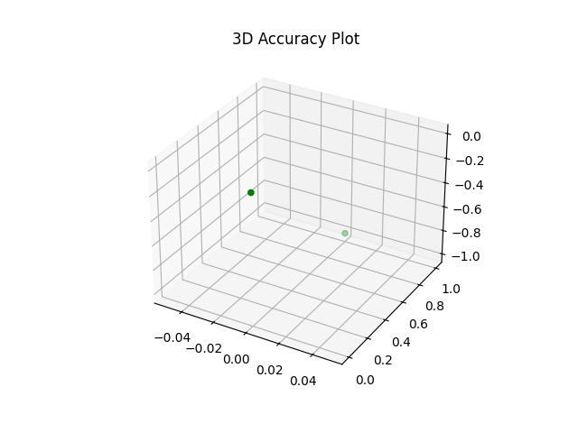

# Human vs Machine Learning Project

This project challenges you to explore the differences between human-designed algorithms and machine learning models. You will first create a human algorithm (pseudo-code) to classify data based on features, then translate that algorithm into Python. Next, you will train a K-Nearest Neighbors (KNN) classifier on the same dataset and compare your results. Finally, you will record a short screen-share with narration explaining your methods and observations.

You may work alone or with a partner. You may choose to work with the provided Penguins dataset, or select your own pre-cleaned dataset from the links below (I have suggested a few datasets as a guide, but you are welcome to select something different with approval).  The most important detail regarding your data-set is that your data needs to lend itself to classification.  For example, an iris with a sepal length of x and a petal width of y can be classified as ‘Setosa’. I also recommend that you use github codespaces, as you will need access to command-line tools that are unavailable in VS Code for EDU.

[UCI Machine Learning Repository](https://archive.ics.uci.edu/datasets)
 - Iris (classic 3-class classification)
 - Mushroom (binary classification: edible/poisonous)
 - Student Performance (predict grades, numeric features)

[Kaggle Datasets](https://www.kaggle.com/datasets)   *Note: For Kaggle, I will have to download the data for you and post on a shared drive.
 - Titanic survival dataset (binary classification)
 - Heart disease dataset (binary classification)
 - Breast cancer diagnosis (binary)
 - Penguins dataset (same as Kira, already cleaned)

---

**Team Members:**  
- Auden Tatler   

**Dataset Used:**  
Fertility

**Source:**  
UCI

**Target Variable (What I am predicting):**  
I am predicting whether fertility is normal or altered based on specific variables.

**Features Used:**  
- Accident 
- Surgical Intervention
- Smoking

**[Video Review](https://)**

## Human Algorithm

### Pseudo-Code
``` 
    if x = 0.0 and y = 1.0 and z = 0.0:
        fertility = altered
    else:
        fertitility = normal
```

When examining the data and visualizations, I focused on the features accident, surgical intervention, and smoking because they had the strongest correlation.

The data was mostly binary, so the values either had to meet a certain criteria or did not. This made the threshold for each value easy to find.

From the summary tables and visualizations, it appeared that a certain quadrant on the 3d model could influence classification, which led me to consider using the variables accident, smoking, and surgical_intervention in my decision rules.

### Confusion Matrix

Accuracy: 56.00%

| Actual \ Predicted   |Altered  | Not Altered (Normal)
|----------------------|---------|----------------------|
| Altered              |   12    |         60           |
| Not Altered (Normal) |   16    |         88           |


Due to the three-dimensional nature of the model, the only valid inputs are accident, surgical_intervention, and smoking.

These examples of success and failure highlight patterns in the data or limitations in my rules, such as the fact that the values were binary, so there was not a certain pattern or plot to track.




**Could only get the correct predictions to display.**

## Machine Learning Model

We chose a value of k = ___ after comparing model performance across different values of k and observing that ___.

When analyzing the outputs and metrics, we noticed that changing k affected ___, which influenced our final choice.

Based on the results shown in the tables or visualizations, k = ___ best matched our goals for model performance because ___.

### Confusion Matrix

Accuracy: ?

| Actual \ Predicted | Class 1 | Class 2 | Class 3 |
|-------------------|---------|---------|---------|
| **Class 1**       |         |         |         |
| **Class 2**       |         |         |         |
| **Class 3**       |         |         |         |

The table/visualization shows a clear pattern where the model predicts ___ when ___, indicating a strong relationship between these features.

The confusion matrix reveals that the model most often confuses ___ with ___, suggesting these classes have similar feature values.

Compared to the human algorithm, the KNN model shows different behavior when ___, as seen in the ___ visualization.


